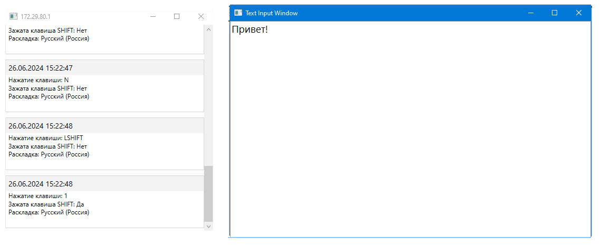

# Задача учебной практики "Кейлоггер"
Написать программу, которая будет считывать нажатие клавиш клавиатуры и передавать данные на другой компьютер. Разумеется, сделать ее надо наименее заметной.
## Решение задачи
Реализовано две программы: программа **SendingApp**, которая отслеживает нажатие клавиш и отправляет данные по сети и программа **ReceivingApp**, которая получает данные.
#### Программа **SendingApp**
Отслеживает нажатия клавиш на клавиатуре и передаёт данные на другой компьютер. Программа не требует установки и работает незаметно для пользователя. При запуске программа считывает из файла **host.txt** локальный адрес компьютера, на который будут отправляться данные и устанавливает соединение. Если принимающий компьютер не ожидает подключения, программа будет производить попытки подключиться каждые 5 секунд. После установки подключения в случае разрыва подключения программа перейдёт снова в режим установки подключения.
Программа написана на языке программирования **C#**.

Реализован класс **WinAPI**, в котором содержатся методы, которые вызывают неуправляемый код из системных библиотек.

Реализован класс **KeyboardTracker**, в котором определён функционал отслеживания нажатия клавиш, используя механизм перехватчиков системных сообщений. Методы StartTracking и StopTracking запускают и останавливают отслеживание нажатий клавиш, метод GetCurrentKeyboardLayout возвращает текущую раскладку клавиатуры, события KeyDown и KeyUp вызываются из процедуры перехватчика и принимают перечисление **Keys**, которое представляет код нажатой клавиши.

Реализован класс **LANManager**, который устанавливает подключение и передаёт данные. Метод Send принимает объект перечисления Keys, текущую раскладку, выраженную объектом типа int, зажата ли клавиша **SHIFT** и дату нажатия клавиши, переводит полученные значения в массив byte и отправляет эти данные на другой компьютер используя объект класса Socket, который создаётся в методе Connect.
#### Программа **ReceivingApp**

Принимает сообщения о нажатии клавиш. Программа написана на языке программирования **C#** и использует платформу **WPF** для реализации графического интерфейса. После запуска программы создаётся поток, который ожидает подключения и в заголовке окна выводится текущий локальный адрес, к которому программа **SendingApp** будет подключаться.
Главное окно программы состоит из элемента ScrollViewer, на котором размещён элемент StackPanel, который является контейнером компоновки, располагающем все элементы в ряд.
При установке соединения добавится элемент с текстом "Подключение установлено". При получении сообщений будут добавляться элементы, содержащие информацию о нажатой клавише, раскладке и была ли зажата клавиша **SHIFT**.
Нажатие клавиши **SPACE** очищает все добавленные элементы.
Нажатием клавиши **ENTER** открывается режим просмотра печати, который отображает вводимый текст, переводя код нажатой клавиши в символ (рисунок 1).